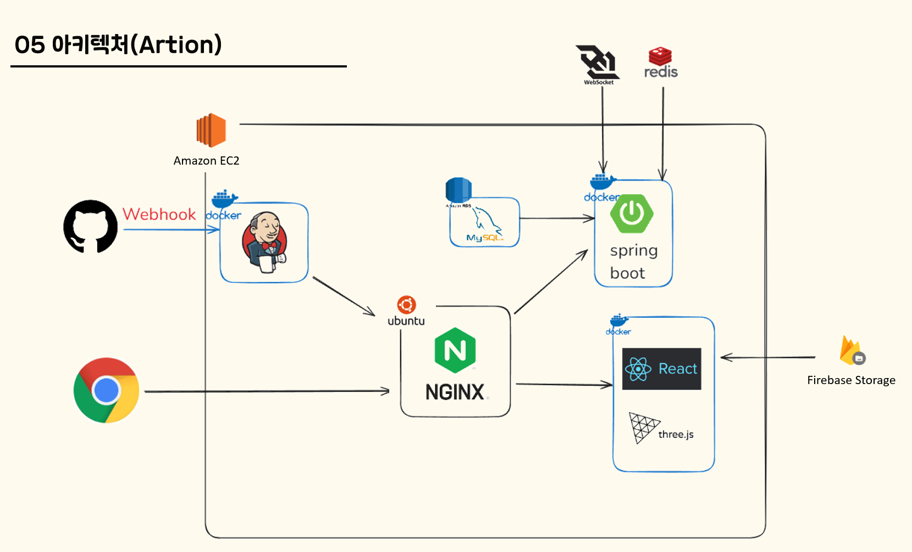
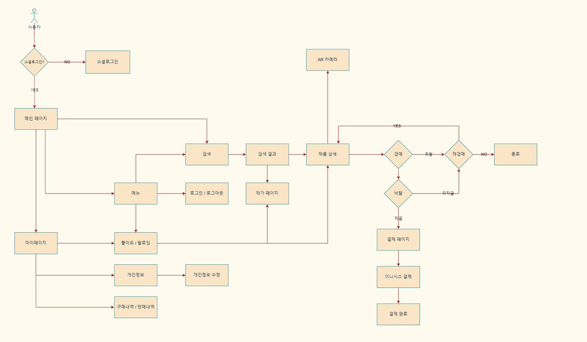
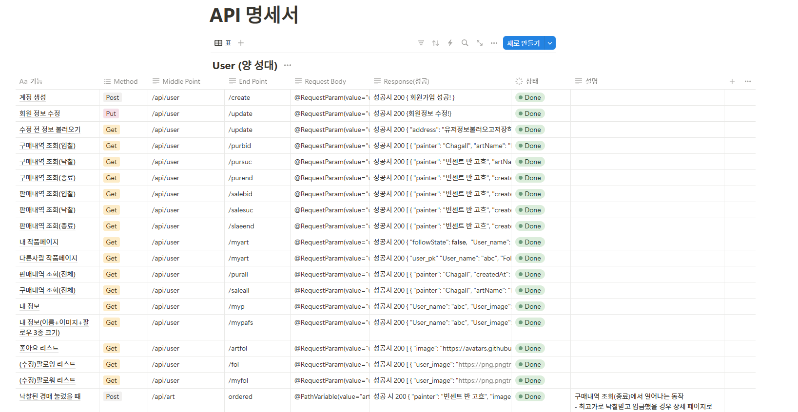
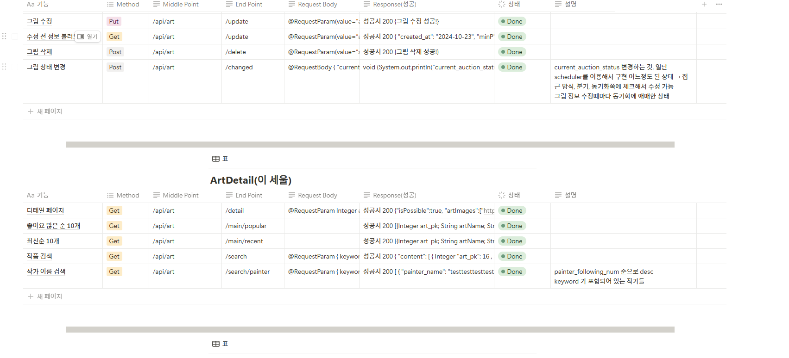
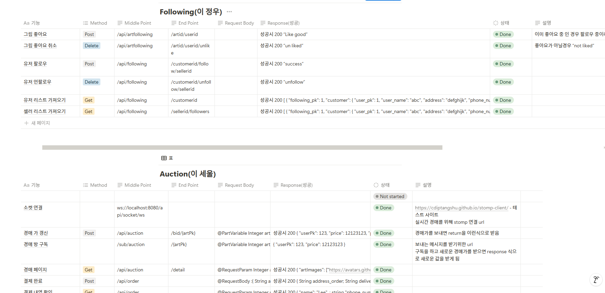
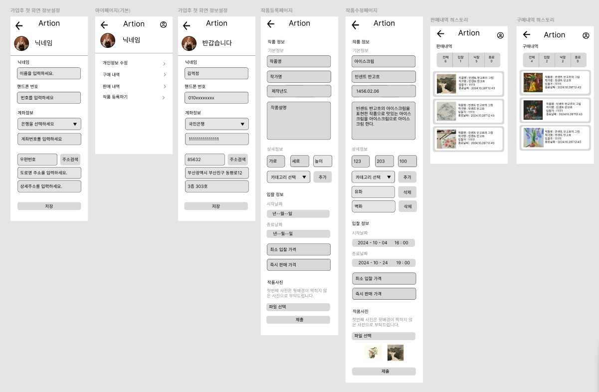
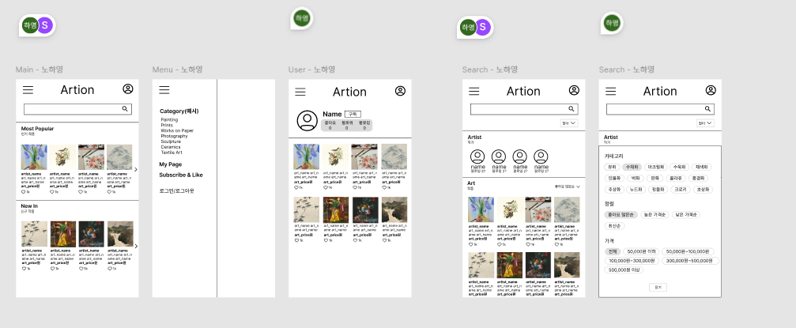
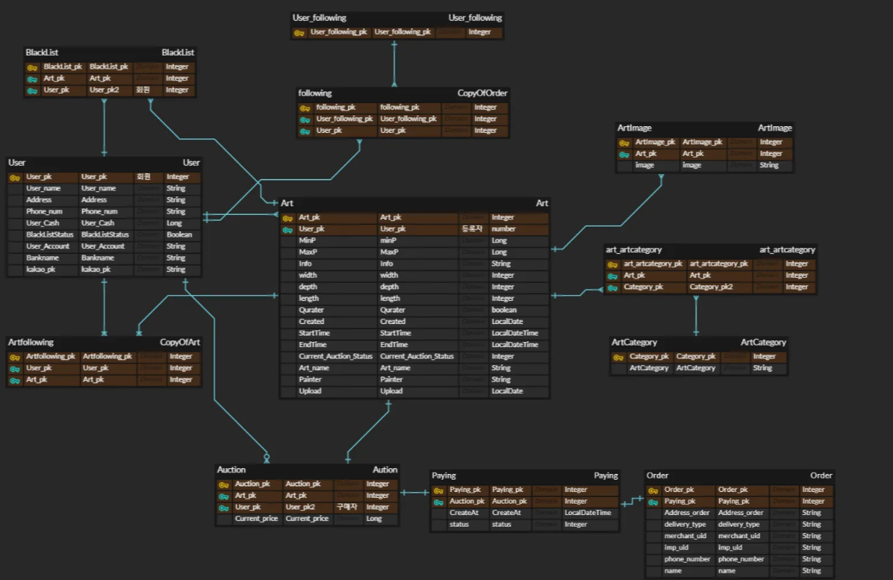

# Artion

### | 그림 경매 및 AR전시 서비스

## 📆 프로젝트 기간

2024.10.02 ~ 2010.10.30 (4주)

## ⭐️ 주요 기능

[YouTube에서 보기](https://youtube.com/shorts/ih9wKytQdoY?si=V0ruLeY9ys0cAuIl)

## 🛠️ 기술 스택

### 공통

### Front-End

### Back-End

### Server

## 📋 설계 산출물 및 관련 문서

### 시스템 아키텍쳐

### 플로우 차트

### 요구사항 정의

### 화면 설계서

#### - 개인정보 페이지

#### - 그림 검색 페이지

#### - 상세 경매 및 입찰 및 그림 전시 페이지

### ER Diagram

### 프로젝트 관련 문서

## 👪 팀원 소개

| 이정우                                  | [이세울](https://github.com/sl39) | 양성대                           | 이지현                              | 오재경                             | 노하영                                  | 주효빈                   |
| ------------------------------------ | ------------------------------ | ----------------------------- | -------------------------------- | ------------------------------- | ------------------------------------ | --------------------- |
| 총괄 팀장, 벡엔드 , AR 전시 서비스, 및 유저 팔로우 서비스 | 백엔드 팀장, 그림 경매 서비스, 그림 입찰 및 소켓  | 벡엔드, 구매내역 및 판매내역 서비스,개인정보 서비스 | 프론트 팀장, UI/UX, 로그인 서비스, 개인정보 서비스 | 프론트,UI/UX, 작품 상세 페이지 및 AR전시 서비스 | 프론트,UI/UX, 메인페이지 및 작품 검색 및 작가 검색 서피스 | 프론트,UI/UX,경매 및 결제 서비스 |
